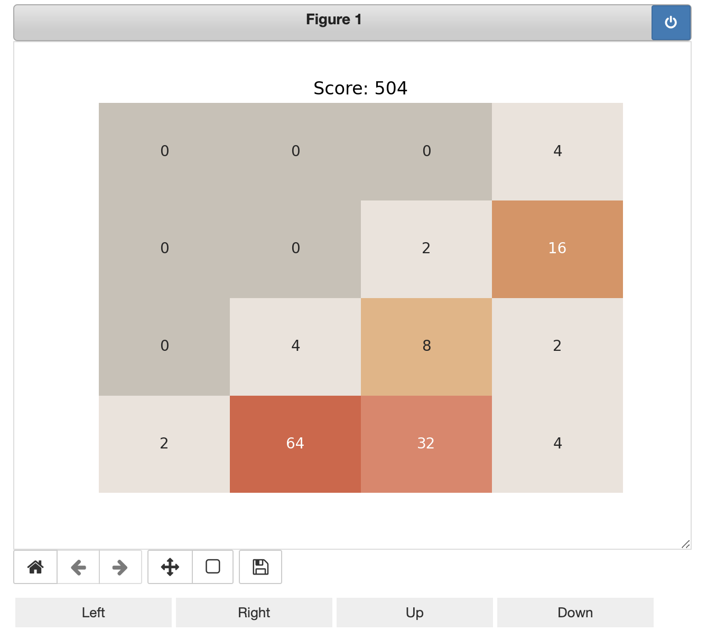

# 2048 in a Jupyter Notebook

What the title says: an implementation of the computer game [2048](https://en.wikipedia.org/wiki/2048_(video_game)) by Gabriele Cirulli, implemented in a single Jupyter notebook using Python and IPyWidgets.

Dependencies are numpy, matplotlib, seaborn, IPyWidgets and of course Jupyter.

The game is controlled via a primitive UI. You can click buttons to move the tiles left, right, up or down.

